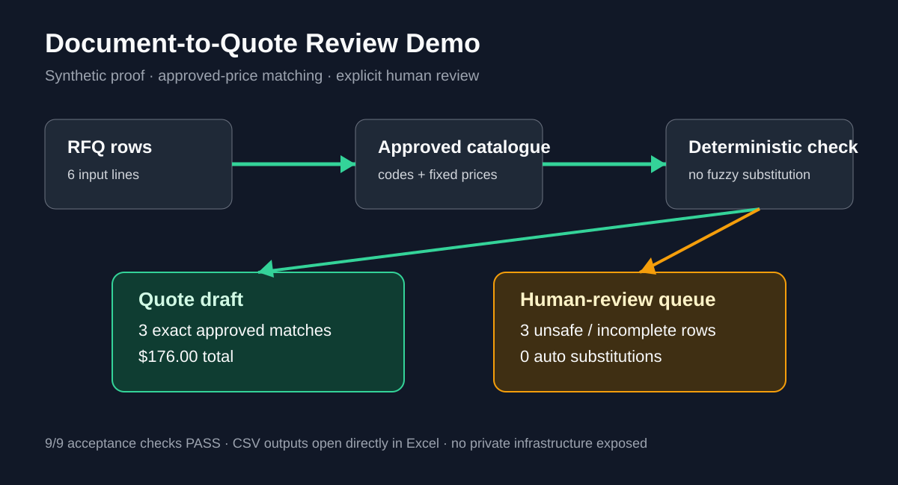

# Document-to-Quote Review Demo

> **Synthetic / internal proof — not a client case.**

A small buyer-facing proof for a common bounded responsibility:

**structured RFQ rows → approved catalogue/price list → quote draft + human-review queue**

The correctness rule is simple: **prices come only from the approved catalogue, and uncertain rows are blocked for review instead of being guessed.**



## Result

This demo contains 6 synthetic RFQ rows:

- **3** rows quoted from approved catalogue codes;
- **3** rows isolated for human review;
- quote draft total: **$176.00**;
- unauthorized price sources: **0**;
- automatic substitutions: **0**;
- automated acceptance checks: **9/9 PASS**.

The important failure case is deliberate: one RFQ row says `Pressure Gauge 0-10 bar` but has no item code. The approved catalogue contains a visually similar `D-400` item. The demo **does not guess the match**; it sends the row to human review.

## Inspect it in under one minute

1. Input RFQ rows: [samples/rfq_rows.csv](samples/rfq_rows.csv)
2. Approved catalogue: [samples/approved_catalogue.csv](samples/approved_catalogue.csv)
3. Quote draft: [outputs/quote_draft.csv](outputs/quote_draft.csv)
4. Review queue: [outputs/review_queue.csv](outputs/review_queue.csv)
5. Acceptance evidence: [ACCEPTANCE.md](ACCEPTANCE.md)

All CSV outputs open directly in Excel.

## What this proves

This proof supports bounded responsibility for:

- deterministic catalogue / price-list matching;
- data normalization and validation;
- explicit exception isolation instead of silent dropping;
- review queues for unknown or unsafe rows;
- reproducible CSV / Excel-compatible output;
- acceptance checks and handoff-ready evidence.

## What it does **not** prove

This demo does not claim:

- a real client engagement;
- production PDF/OCR extraction;
- fuzzy product substitution;
- ERP integration;
- automatic email sending;
- production n8n / Make ownership;
- enterprise-scale or regulated workflow responsibility.

Those require the actual client input, environment, and acceptance boundary to be inspected first.

## Reproduce

Requires Python 3 and the standard library only.

```bash
python src/build_quote.py
python tests/verify_outputs.py
```

Expected final line:

```text
9/9 acceptance checks PASS
```

## Responsibility this supports

A suitable first paid slice is:

> Given an agreed structured extraction format plus an approved catalogue/price list, produce a quote draft for exact approved matches, isolate unsafe rows for review, and deliver acceptance evidence plus the resulting Excel-compatible files.

See [PROVENANCE.md](PROVENANCE.md) for how this public-facing proof relates to earlier internal synthetic validation.
